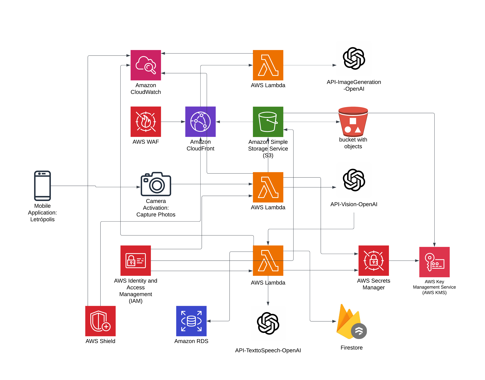

# Letrópolis - Aprendizaje Divertido de Palabras con IA

## 🎯 Descripción

Letrópolis es una aplicación móvil educativa diseñada para niños de 6 años en adelante, que transforma el aprendizaje de nuevas palabras en una aventura interactiva. Utilizando la cámara del dispositivo y potenciada con Inteligencia Artificial, la aplicación permite a los niños explorar su entorno mientras aprenden nuevo vocabulario de manera divertida y dinámica.

## 🎥 Demo

  

## 🤖 ¿Cómo Funciona?

1. El niño toma fotos de objetos en su entorno usando la cámara
2. Letro, nuestra mascota virtual con IA, identifica el objeto y lo describe de forma divertida
3. Por cada palabra identificada, el niño obtiene una sílaba aleatoria
4. Al juntar sílabas, los niños pueden formar nuevas palabras
5. Cuando se forma una palabra, Letro la presenta con una imagen generada por IA
6. Todas las palabras aprendidas se guardan en un diccionario digital personal

## 🛠 Tecnologías Utilizadas

### Frontend

- Flutter para desarrollo multiplataforma
- AWS Amplify para CI/CD
- CloudFront para distribución de contenido

### Backend

- AWS Lambda para procesamiento serverless
- Docker para containerización
- API Gateway para gestión de endpoints
- OpenAI APIs (Vision, Text-to-Speech, Image Generation)

### Seguridad

- AWS WAF para protección de aplicación
- IAM para gestión de accesos
- AWS Shield para protección DDoS
- AWS KMS para gestión de claves

### Almacenamiento y Base de Datos

- Amazon S3 para almacenamiento de objetos
- Amazon RDS para base de datos relacional
- Firestore para datos en tiempo real

### Monitoreo

- Amazon CloudWatch para logs y métricas

## 📐 Arquitectura AWS

  

## 🔒 Características de Seguridad

- Autenticación segura mediante AWS IAM
- Cifrado de datos en reposo y en tránsito
- Firewall de aplicaciones web (WAF)
- Gestión de secretos con AWS Secrets Manager

## 🎯 Objetivo

Crear una experiencia educativa inmersiva que motive a los niños a explorar y aprender nuevo vocabulario a través de la interacción con su entorno, utilizando tecnología de punta de manera segura y divertida.
